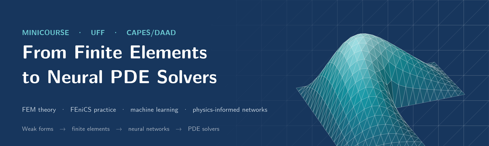
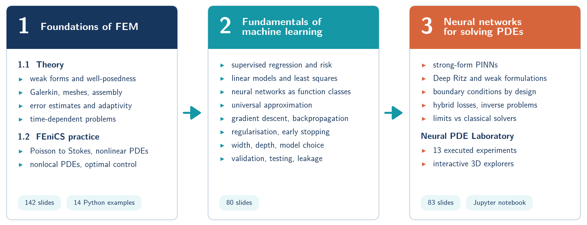
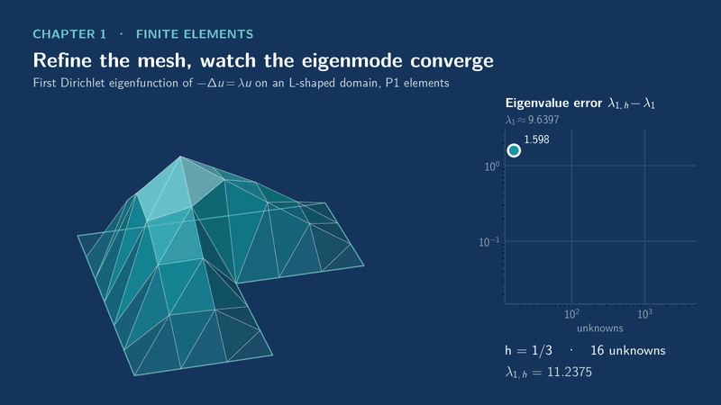
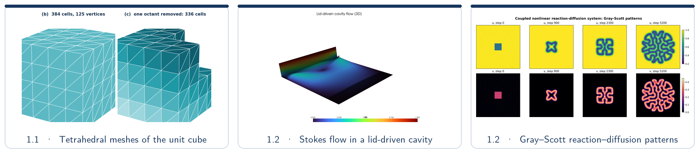
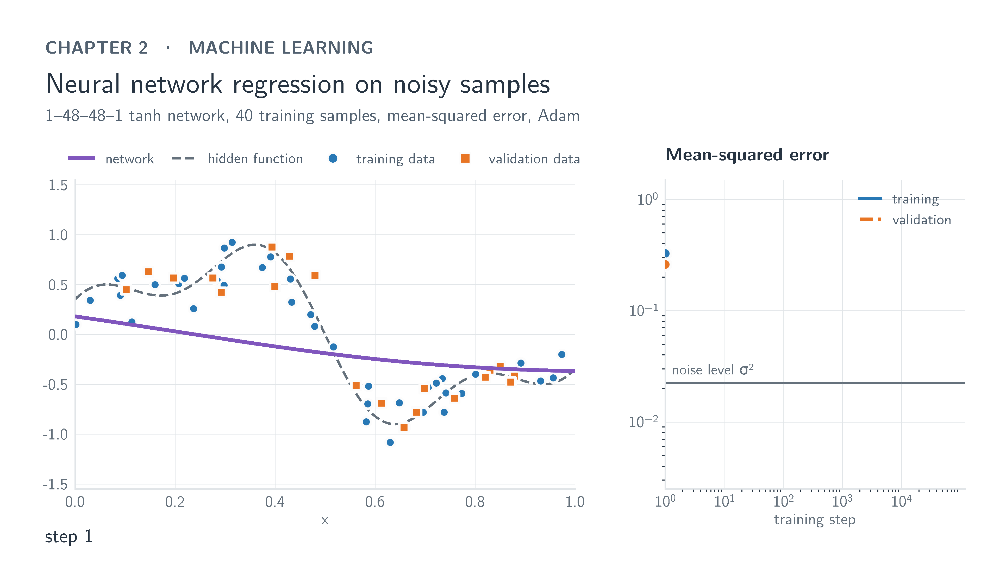
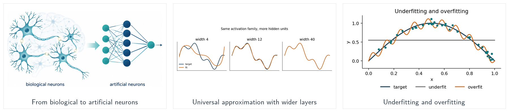
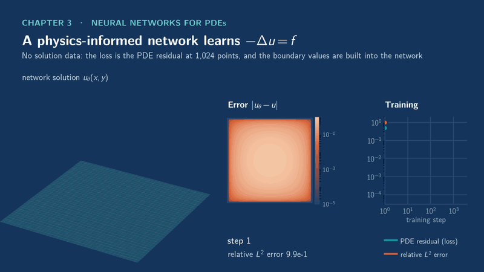
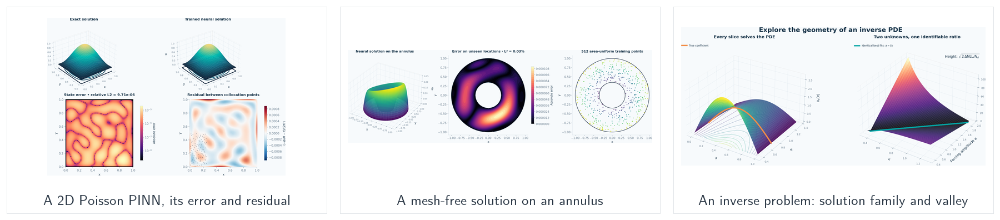

<p align="center">
  
</p>

<p align="center">
  <b>Lecture slides, runnable FEniCSx examples and neural-PDE laboratory notebooks</b><br>
  <a href="#1-theoretical-and-computational-foundations-of-fem">Finite elements</a> &nbsp;·&nbsp;
  <a href="#2-fundamentals-of-machine-learning">Machine learning</a> &nbsp;·&nbsp;
  <a href="#3-neural-networks-for-solving-pdes">Neural networks for PDEs</a> &nbsp;·&nbsp;
  <a href="#getting-started">Getting started</a>
</p>

This minicourse covers finite elements, machine learning, and neural methods for PDEs.
We start with weak formulations and implement them in FEniCS, then learn how to train
neural networks and use them as PDE solvers. The examples compare PINNs and Deep Ritz
with classical methods and show how observations help recover unknown coefficients.

<p align="center">
  
</p>

| | Chapter | Slides (PDF) | Hands-on |
|:-:|---|---|---|
| **1.1** | [Theoretical foundations of FEM](1.%20Theoretical%20and%20computational%20foundations%20of%20FEM/1.1.%20Theoretical%20foundations) | [Finite element methods: foundations](1.%20Theoretical%20and%20computational%20foundations%20of%20FEM/1.1.%20Theoretical%20foundations/1.1_fem_foundations.pdf) · 69 slides | |
| **1.2** | [Computational practice with FEniCS](1.%20Theoretical%20and%20computational%20foundations%20of%20FEM/1.2.%20Computational%20practice%20with%20FEniCS) | [Part I](1.%20Theoretical%20and%20computational%20foundations%20of%20FEM/1.2.%20Computational%20practice%20with%20FEniCS/1.2_fenics_part1.pdf) · 38 slides<br>[Part II](1.%20Theoretical%20and%20computational%20foundations%20of%20FEM/1.2.%20Computational%20practice%20with%20FEniCS/1.2_fenics_part2.pdf) · 35 slides | 14 Python examples |
| **2** | [Fundamentals of Machine Learning](2.%20Fundamentals%20of%20Machine%20Learning) | [Neural networks for supervised regression](2.%20Fundamentals%20of%20Machine%20Learning/2_machine_learning_fundamentals.pdf) · 80 slides | |
| **3** | [Neural networks for solving PDEs](3.%20Neural%20networks%20for%20solving%20PDEs) | [From data-driven regression to PINNs, Deep Ritz and hybrid losses](3.%20Neural%20networks%20for%20solving%20PDEs/3_neural_networks_for_pdes.pdf) · 83 slides | slide experiments, [lab notebooks](3.%20Neural%20networks%20for%20solving%20PDEs/NOTEBOOK_README.md) |

---

## 1. Theoretical and computational foundations of FEM

<p align="center">
  <a href=".github/readme/fem_eigenmode_still.png">
    
  </a>
</p>
<p align="center"><sub>P1 finite elements for the first Dirichlet eigenfunction of the L-shaped domain. The eigenvalue error falls with every refinement, at a rate limited by the re-entrant corner.</sub></p>

**[1.1 Theoretical foundations](1.%20Theoretical%20and%20computational%20foundations%20of%20FEM/1.1.%20Theoretical%20foundations)**
&nbsp;·&nbsp; We use the Poisson equation to introduce weak formulations, Galerkin
approximation, finite element spaces, and assembly. Error estimates lead to adaptive
refinement; the heat equation then introduces time stepping.

**[1.2 Computational practice with FEniCS](1.%20Theoretical%20and%20computational%20foundations%20of%20FEM/1.2.%20Computational%20practice%20with%20FEniCS)**
&nbsp;·&nbsp; Implement the weak forms and check the computed solutions. *Part I* covers
Poisson convergence tests, Neumann problems with local refinement, the
L-shaped eigenproblem, the heat equation, a nonlinear Poisson equation and Stokes flow.
*Part II* covers a 3D p-Laplacian, nonlocal parabolic PDEs, degenerate null control,
PDE-constrained optimal control and a coupled reaction–diffusion system. Every example
has a script in `experiments/`.

<p align="center">
  
</p>

## 2. Fundamentals of Machine Learning

<p align="center">
  <a href=".github/readme/ml_training_still.png">
    
  </a>
</p>
<p align="center"><sub>A 1–48–48–1 tanh network trained with Adam on 40 noisy samples. Training error keeps falling after validation error starts to rise. Early stopping keeps the checkpoint with the lowest validation error.</sub></p>

**[Neural networks for supervised regression](2.%20Fundamentals%20of%20Machine%20Learning/2_machine_learning_fundamentals.pdf)**
&nbsp;·&nbsp; Population and empirical risk, linear models, neural networks as function
classes and the universal approximation theorems (Cybenko, Pinkus), gradient descent and
backpropagation, regularisation and early stopping, width and depth, and validation and
testing without leakage.

<p align="center">
  
</p>

## 3. Neural networks for solving PDEs

<p align="center">
  <a href=".github/readme/pinn_training_still.png">
    
  </a>
</p>
<p align="center"><sub>A PINN for −Δu = 2π² sin(πx) sin(πy) on the unit square, trained only on the PDE residual at 1,024 points, with the boundary condition built into the network. After 3,000 Adam steps the relative L² error is about 7·10⁻⁵.</sub></p>

**[From data-driven regression to PINNs, Deep Ritz and hybrid losses](3.%20Neural%20networks%20for%20solving%20PDEs/3_neural_networks_for_pdes.pdf)**
&nbsp;·&nbsp; Strong-form PINNs (collocation, quadrature, stability and error, training
limits), network design and exact boundary conditions, Deep Ritz and weak formulations,
hybrid PDE–data losses and inverse problems. We also examine the training difficulties
and compare with classical solvers. The scripts in `experiments/` reproduce the slide results.

**[Neural PDE Laboratory](3.%20Neural%20networks%20for%20solving%20PDEs/NOTEBOOK_README.md)**
&nbsp;·&nbsp; Run 13 experiments, inspect the errors, and try changing the setup. Topics include
a vibrating membrane, sensor placement, Gray–Scott patterns, Fourier features, adaptive
sampling, heat flow, and a network trained for several PDE parameters. Seven independent
notebooks include saved static plots for convenient GitHub previews. To browse the
figures and seven interactive plots, download
`notebook_outputs/` and open `index.html` in a browser.

<p align="center">
  
</p>

---

## Repository layout

```text
.
├── 1. Theoretical and computational foundations of FEM/
│   ├── 1.1. Theoretical foundations/
│   │   ├── 1.1_fem_foundations.tex / .pdf        slides
│   │   └── figures/                              figures of the slides
│   └── 1.2. Computational practice with FEniCS/
│       ├── 1.2_fenics_part1.tex / .pdf           Part I: from weak forms to working code
│       ├── 1.2_fenics_part2.tex / .pdf           Part II: advanced PDE examples
│       ├── environment.yml                       FEniCSx environment
│       └── experiments/                          example scripts 01–14
│           ├── figures/                          their plots, used by the slides
│           └── results/                          XDMF/HDF5 fields, CSV tables, run logs
├── 2. Fundamentals of Machine Learning/
│   ├── 2_machine_learning_fundamentals.tex / .pdf
│   └── figures/
└── 3. Neural networks for solving PDEs/
    ├── 3_neural_networks_for_pdes.tex / .pdf
    ├── experiments/                              scripts, results and figures behind the slides
    ├── Neural_PDE_Laboratory.ipynb               laboratory index
    ├── Neural_PDE_01_*.ipynb … Neural_PDE_07_*.ipynb  seven executed lab notebooks
    ├── Neural_PDE_Laboratory_bundle.zip          all notebooks and outputs in one download
    └── notebook_outputs/                         figures and interactive HTML explorers
```

Each chapter folder has its own README with more detail.

## Getting started

**Read the slides.** The PDFs sit next to their LaTeX sources (see the table above).

**Rebuild a deck.** From the deck's folder, run `latexmk -pdf <deck>.tex`. This needs a TeX
distribution with Beamer, TikZ/PGFPlots, `listings` and `lmodern`; the FEniCS decks also
use `appendixnumberbeamer`.

**Run the FEniCSx examples** (Chapter 1.2):

```sh
cd "1. Theoretical and computational foundations of FEM/1.2. Computational practice with FEniCS"
conda env create -f environment.yml
conda activate fenicsx-env
python experiments/01_poisson.py
```

The scripts write to `experiments/figures/` and `experiments/results/` from any working
directory. On a machine without a display, set `PYVISTA_OFF_SCREEN=true` first.

**Run the neural-PDE laboratory** (Chapter 3):

```sh
cd "3. Neural networks for solving PDEs"
python -m pip install -r experiments/requirements-notebook.txt
python -m jupyter lab Neural_PDE_01_foundations.ipynb
```

## About the README graphics

The graphics use a restrained palette and fixed viewpoints, with pauses to read each
result. Animations are rendered at 3840 × 2160 with a 256-color palette; click an
animation to open its lossless, full-resolution final frame. The animations show a
P1 finite element eigenfunction on an L-shaped domain, a network fitting noisy data,
and a PINN solving Poisson. To rerun the computations and rebuild
the graphics, run `python .github/readme/generator/make_all.py` with NumPy, SciPy,
Matplotlib, Pillow, and PyTorch installed.
